<!-- to do: 

* find the comments everywhere!
* find out how to host this in github pages  https://pages.github.com/
* find out how to password protect it (one page with a picture of the players in front of the door wiht angry faces "say the mighty password or you shall not pass", when the password is correct, a similar picture but with the open door and friendly faces saying "that was correct! Dig right in" where you can click and go to the guidelines)
* videos in tactic board for all calls
* videos online for some of the calls
* re-do pictures (setup, 2-2-, 3-1) with bigger text and reduce web scale

* part 2? 
## V. TITLE
### If you have a menstrual period
### What to pack for a tournment
### What to do about your piercings
### Trans women, non-binary, agender and intersex folks welcome

* for github pages: https://github.com/hackclub/ai-safety-dance

-->

## I. Intro: How to use this document

Welcome to our the Freiburg Women*'s team 7s Guidelines! This document is designed to help you understand the essential aspects of our game, from the basic laws to our specific strategies. This guide will be our go-to resource for learning and mastering our team’s 7s playstyle. We’ve structured the document to provide clear and comprehensive information, so you can easily find what you need. This document is designed for internal use and for supporting our club so it shouldn't be shared without permission.

Let’s work together to build a strong, skilled team and enjoy every moment on the pitch!

Dynamite BOOM!!!!!

## II. Laws 
### Simplified guide

Here is a simplified guide with some basic information created by one of our teammates:

<object
type="application/pdf"
data= "img/How_to_rugby.pdf"
width="800"
height="300"
border="pixels"
>
</object>

 &nbsp; <!--this is a space-->

### Intro to 7s

Watch <a href="https://www.youtube.com/watch?v=1e894rFZvqQ">this video</a> (2:30 minutes) for a very quick 101 guide to Rugby Sevens

 &nbsp; <!--this is a space-->

<a href="https://www.youtube.com/watch?v=1e894rFZvqQ">
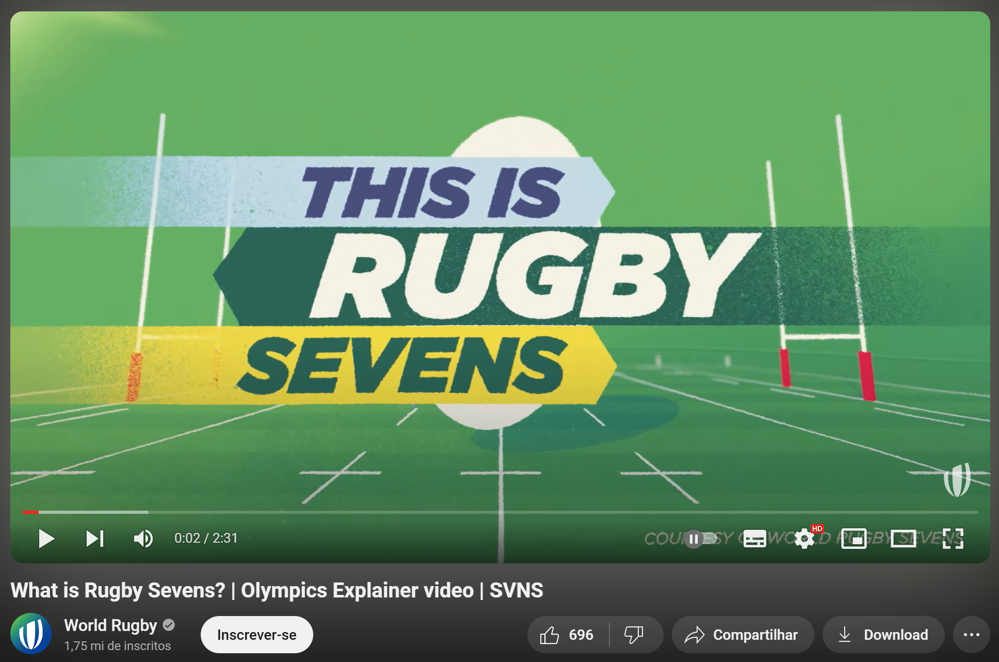
</a>

### Cool app
Download the Rugby Laws App for free if you got curious and want more detailed, in-depth information. 

<a href="https://play.google.com/store/apps/details?id=org.worldrugby.lawsofrugby&hl=en_GB">iOS</a>

&nbsp;&nbsp;&nbsp;&nbsp;&nbsp;<!--&nbsp; is an empty space character -->
<a href="https://play.google.com/store/apps/details?id=org.worldrugby.lawsofrugby&hl=en_GB">Android</a> 

 &nbsp; <!--this is a space-->

In the app, among other cool resources, you can find a list of all <b>rugby laws</b> explained with images and videos, a list of <b>definitions</b> with lots of rugby terms such as "lineout", "scrum" or "maul", or a very clear list of <b>referee signals</b> used by the refs during the games with videos and explanation.

&nbsp;<!--&nbsp; is an empty space character -->

&nbsp;<!--&nbsp; is an empty space character -->

## III. Basics structure

In this section, we’ll outline our team's basic structure and strategies, covering crucial aspects such as defense, attack, lineouts, kick-offs, and penalties. Each area will be discussed in detail to ensure everyone knows their role and how we approach different game scenarios. At the end of this section, you’ll find a table of contents with key terminology and a list of common calls used during matches.

### Offense

#### Position on the field

  
<b> Setup for Offense </b>

When attacking, players should stand in a "V" shape formation and try to maximize space in the field to stretch the defense and to help the team find or create gaps.

  
<b> 3-1 split </b>

- When the player at first position takes the ball into contact, the link and centre are the players usually expected to support the attack. This leaves a complete 3-player attacking unit on one side of the field, and just one player, usually the wing, on the other side of the field. An attack on first creates a valuable 3-1 split field. The halfback can either pass to the 3-player attacking unit on one side of the ruck, or run the ball towards the wing on the other side. On the halfback's approach to the ruck, both he and the wing should be looking to see if there is an opportunity to join forces for an easy 2 v 1
- link: can call "rot" or "weiß"
- attack pod: can call a play; looks for weaknesse
	
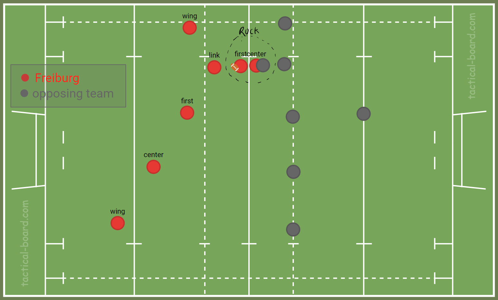

  
<b> 2-2 split </b>

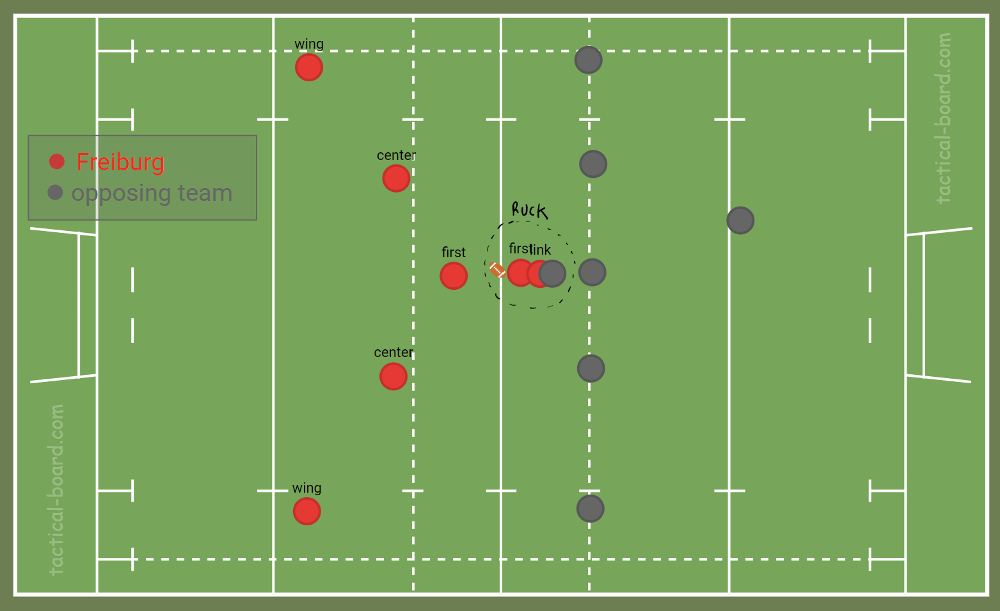

#### Calls in offense

  
 *henry* (hands) 

		   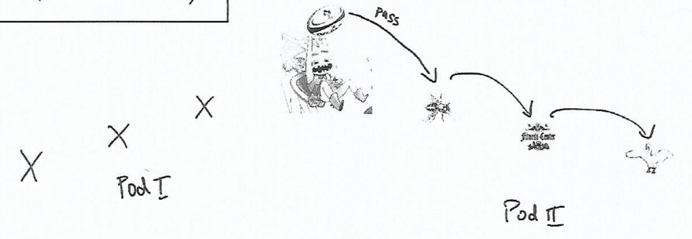

  
 *crash* (hands) 

		   

  
 *paco* (schere) 

			

  
 *joster* (Überpass) 

		  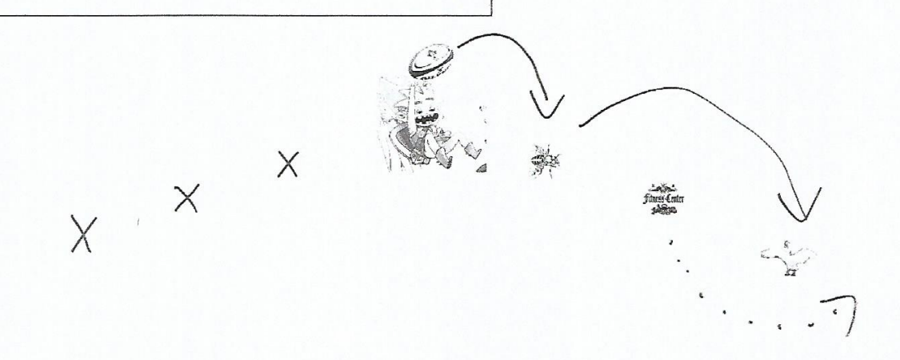

  
 *louis* (loop) 

			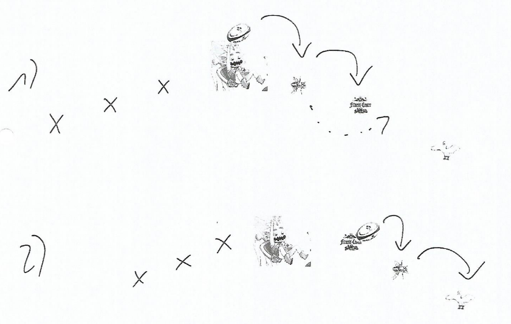

  
 *dobbie* (double Schere/fake Schere) 

			- four options
				- 1st paco
				- run in gap between D2 and D3
				- 2nd paco
				- run ousite D3
			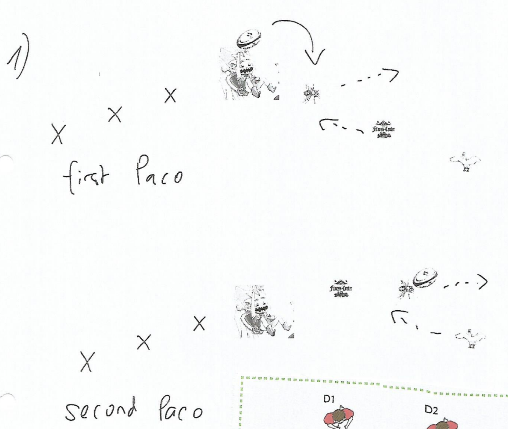
			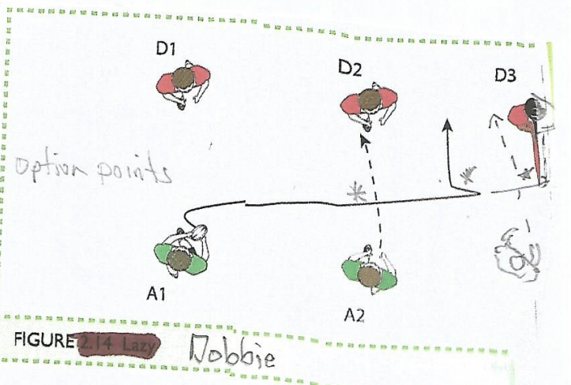

  
 *rot-weiß*/*weiß-rot*  

			- weiß = links; rot = rechts
			

  
 *peter* (put away) 

			- An offload in the tackle to a support player hitting the ball at pace is a simple but extremely effective way to break a defence. And the 'put-away' is effectively just this- an offload in the tackle with support - but where the offload and support is coordinated and not spontaneous. Most offloads happen in a game on impulse, when the ball carrier frees his arms in a tackle and has close support running on to the ball. The 'put-away' is a play that ensures both of these things happen from one simple call.
			- The ball carrier must first identify which defender is marking him, and then let the inside player know his intention ('Hey, John, I'm going to put you away'). Remember the simple lesson of when the ball carrier runs right, space is created on the left and vice versa. In a 'put-away, the ball carrier identifies which defender is marking him, steps inside the defender, engaging him in a tackle, and then makes an immediate offload to a support runner hitting space outside. In a 'put-away, it is not necessary for the ball carrier to beat the defender outright, but just to get to his inside and stretch him enough to make any tackle a passive one, which allows the offload. The success of the offload will be determined by the quality of the run, and so the ball carrier must aim to be as dynamic as possible also maintain leg drive through contact and aim to offload.
			
			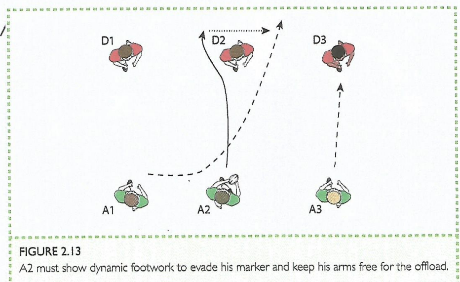
		

  
 *drecksau* (run the short side of the scrum) 

			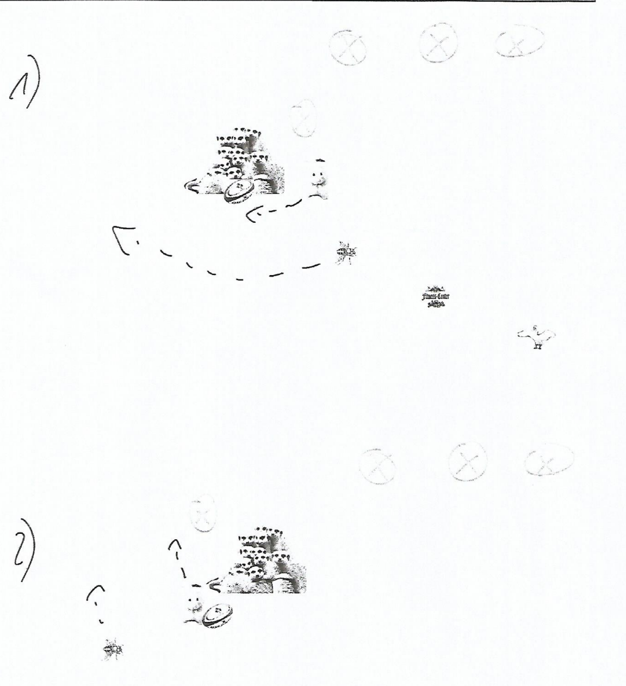

### Defense
#### Position on the field

  
<b> Setup for Defense </b>

  
When defending, our team should a straight line across the field. All seven players should stand side by side with no gaps between them. This way, you cover the entire width of the field and make it harder for the other team to break through. As the other team attacks, you move up together in your line, staying close to each other and communicating to make sure no one slips through. The goal is to keep the attackers in front of you, block their progress, and try to force a mistake so you can win the ball back.

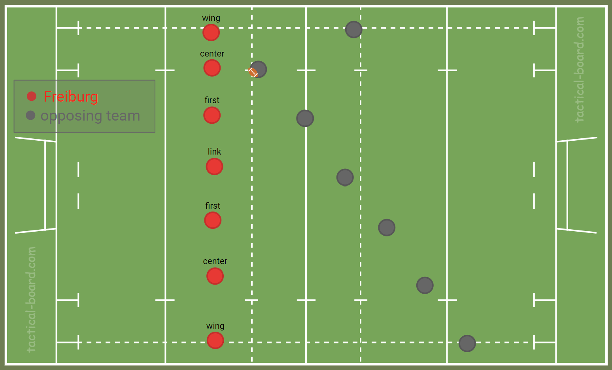

		

  
<b> Basics of Defense </b>

Most players should target the inside shoulder:
In defense, aiming for the inside shoulder of the ball carrier helps guide them toward the sideline, limiting their options and making it easier to tackle or force them out of play. This also prevents the attacker from cutting back inside, which could break the defensive line.
		
But the wing should target the outside shoulder:
By focusing on the outside shoulder, the winger can guide the attacker back towards the center of the field, where there are more defenders to help make the tackle. This approach also reduces the risk of the attacker breaking free along the wing, which is often the fastest route to the try line.

		  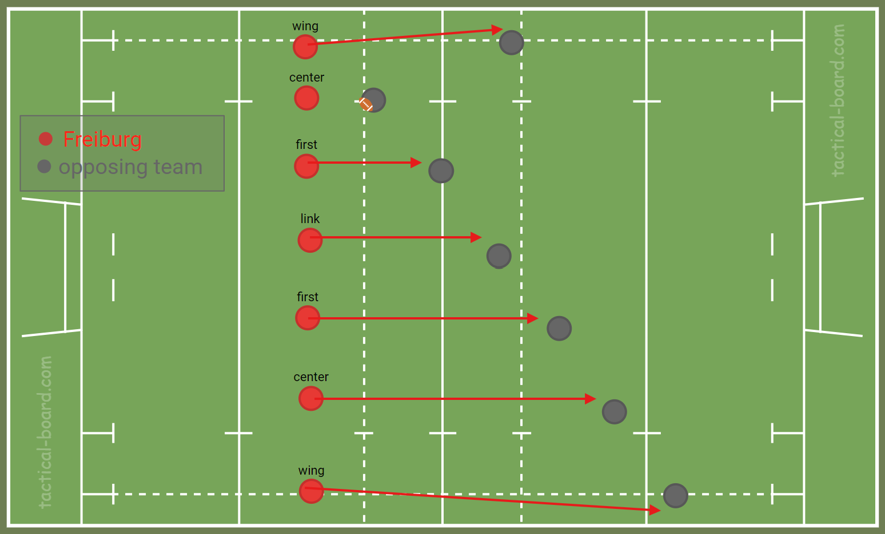

		
#### Calls in defense

  
 *numbers* 

			- this is a rushed defense bla bla bla
			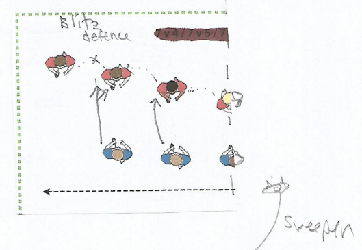

  
 *schieben* 

			- this is the slide defense bla bla
			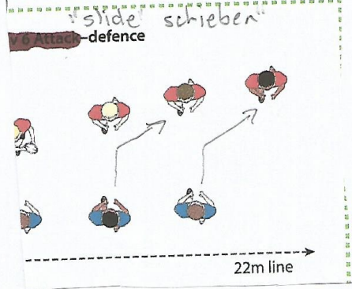

#### Tackling

Watch <a href="https://www.youtube.com/watch?v=seQvXqK8FUk&list=TLPQMDMwOTIwMjQ6-6nPraxJzA&index=2">How to Rugby Tackle</a> (6:45 minutes) for a quick 101 guide to tackling.

 &nbsp; <!--this is a space-->

<a href="https://www.youtube.com/watch?v=seQvXqK8FUk&list=TLPQMDMwOTIwMjQ6-6nPraxJzA&index=2">
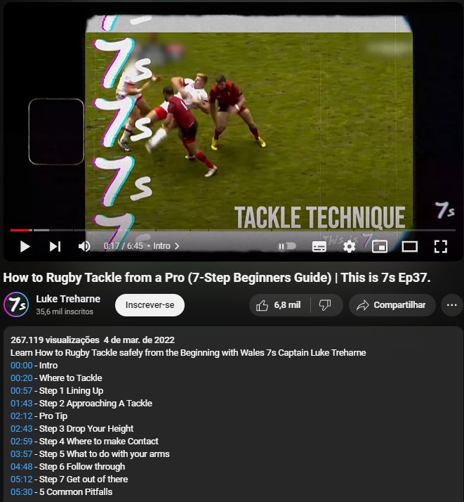
</a>

 
<!--embed it here and add the description-->
			

### Kick-offs
#### We are kickin'

		

  
<b> Setup for a Kick-off </b>

  
<!--picture showing the set up-->

- 4 players on the side of a kick call 
  

  
<b> Calls </b>

- *cover (rot/weiß)*: deep kick
- *robber (rot/weiß)*: short kick

So: If kicker calls *robber rot*, the expected result is a short kick to the right. If the kicker calls *cover rot*, the expected result is a deep kick to the right
	

#### We are receiving the kick

  
<b> Setup for Receiving a Kick-off </b>

  
		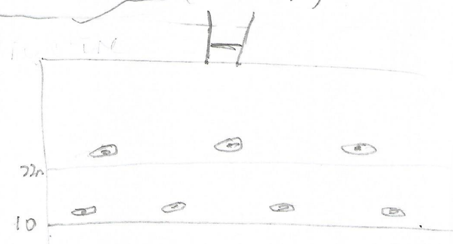

  
<b> You caught the ball now what? </b>

  
<!--text explaining our strategies on what to do when players in all positions receive the ball-->
  

### Line-outs

### Scrum-downs

### Penalties

## IV. Strategies for special cases
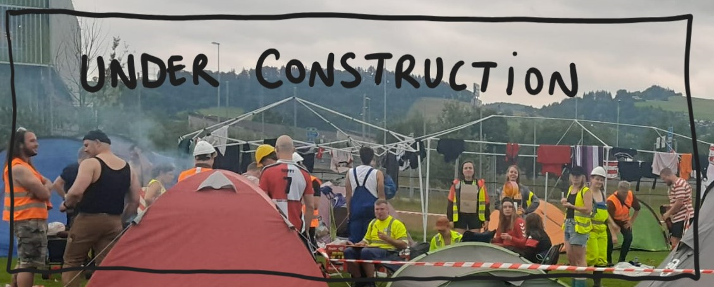
<!--make the under construction picture appear smaller-->
<!--what to do if we have a fast or strong team; sweeper or not; etc etc etc-->
<!--add as a picture "signature" with "St. Gallen 2024"-->

## V. Glossary 
<!-- page/table for all terminology/calls/etc -->

