## I. Intro: How to use this document

Welcome to our the Freiburg Women*'s team 7s Guidelines! This document is designed to help you understand the essential aspects of our game, from the basic laws to our specific strategies. This guide will be our go-to resource for learning and mastering our team’s 7s playstyle. We’ve structured the document to provide clear and comprehensive information, so you can easily find what you need. This document is designed for internal use and for supporting our club so it shouldn't be shared without permission.

Let’s work together to build a strong, skilled team and enjoy every moment on the pitch!

Dynamite BOOM!!!!!


## II. Laws 

Here is a simplified guide with some basic information: (Anna's guide) 

A quick intro video https://www.youtube.com/watch?v=1e894rFZvqQ

For detailed, in-depth information, download the "Rugby Laws" HERE (copy links for iOS and Android https://www.world.rugby/the-game/laws/home) 


## III. Basics structure

In this section, we’ll outline our team's basic structure and strategies, covering crucial aspects such as defense, attack, lineouts, kick-offs, and penalties. Each area will be discussed in detail to ensure everyone knows their role and how we approach different game scenarios. At the end of this section, you’ll find a table of contents with key terminology and a list of common calls used during matches.

<div class="tabset">

### Offense

#### Position on the field

<details>
  <summary> Setup </summary>
  

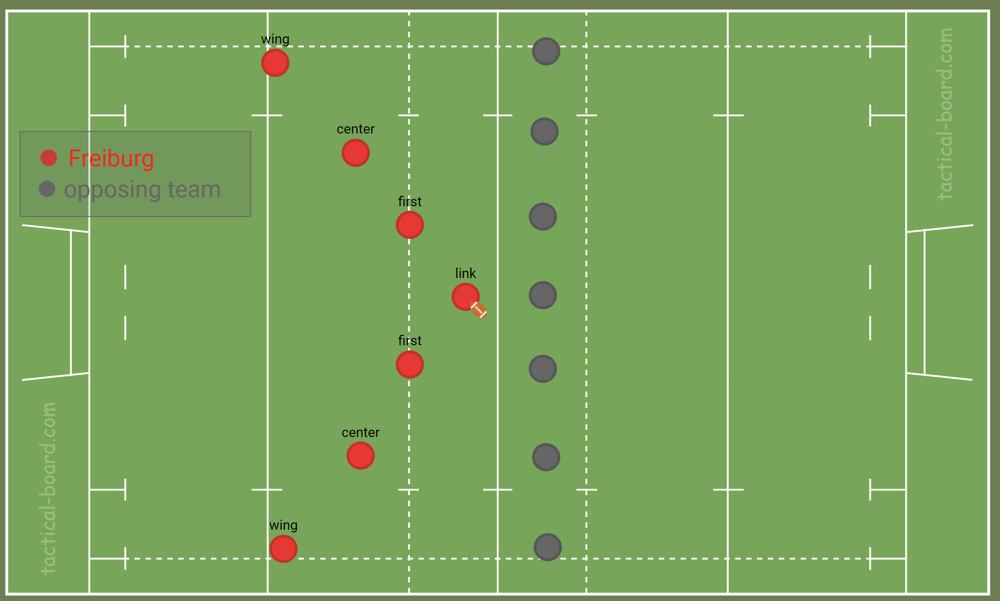

</details>

<details>
  <summary> 3-1 split </summary>
- When the player at first position takes the ball into contact, the link and centre are the players usually expected to support the attack. This leaves a complete 3-player attacking unit on one side of the field, and just one player, usually the wing, on the other side of the field. An attack on first creates a valuable 3-1 split field. The halfback can either pass to the 3-player attacking unit on one side of the ruck, or run the ball towards the wing on the other side. On the halfback's approach to the ruck, both he and the wing should be looking to see if there is an opportunity to join forces for an easy 2 v 1
			- link: calls "rot" or "weiß"
			- attack pod: can call a play; looks for weaknesse
	
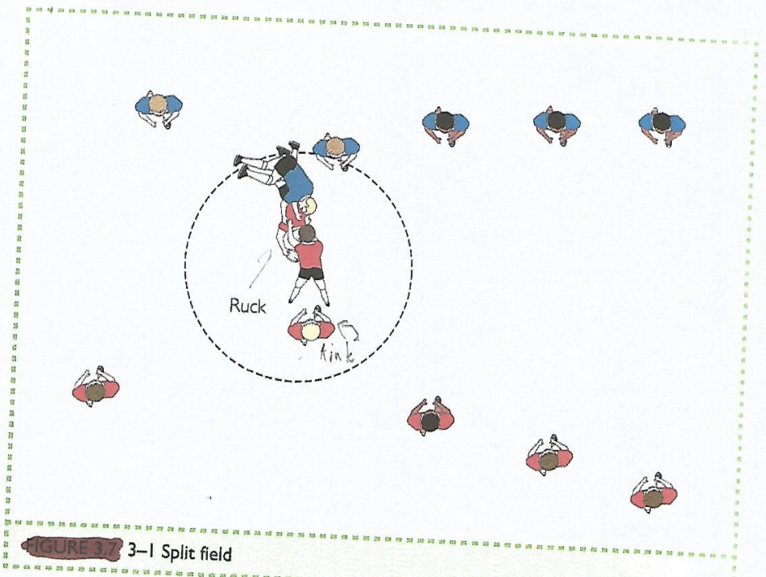
</details>

<details>
  <summary> 2-2 split </summary>

 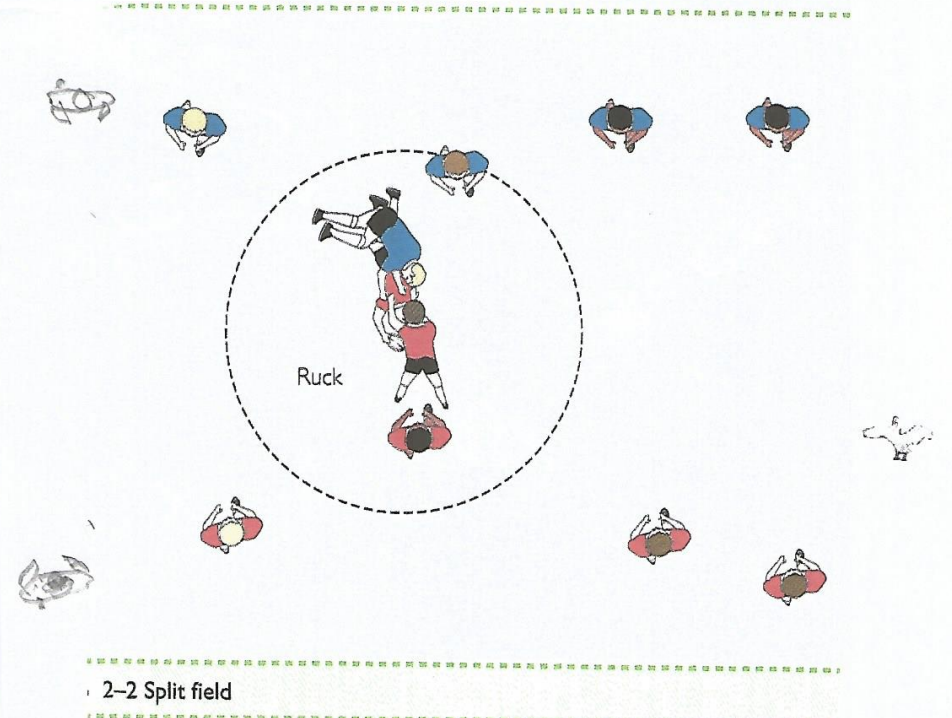
</details>

#### Calls in offense
<details>
  <summary> *henry* (hands) </summary>
		   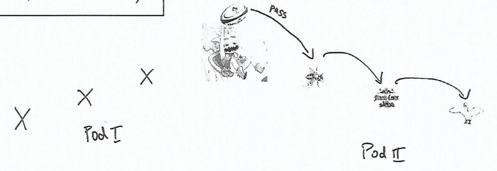
</details>

<details>
  <summary> *paco* (schere) </summary>
			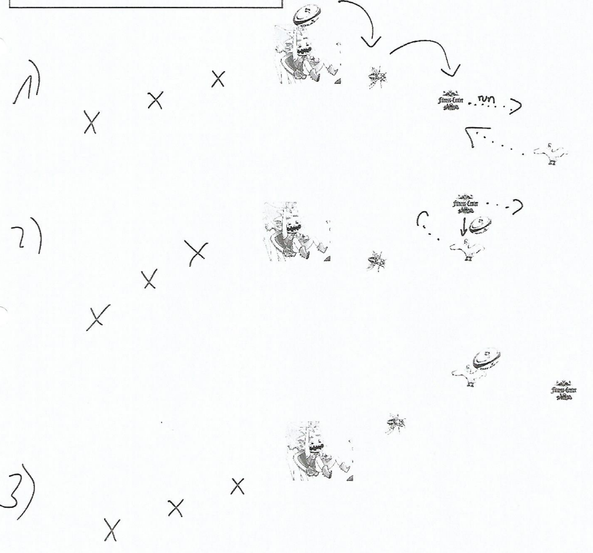
</details>

<details>
  <summary> *joster* (Überpass) </summary>
		  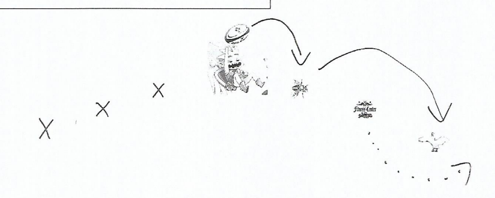
</details>

<details>
  <summary> *louis* (loop) </summary>
			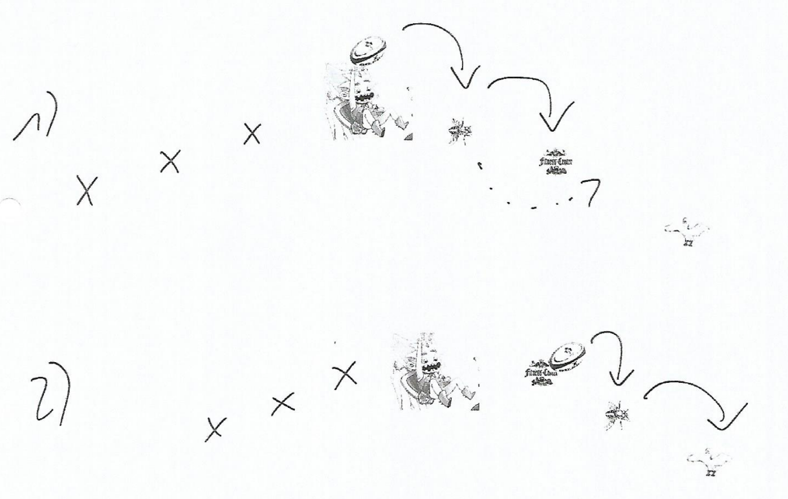
</details>

<details>
  <summary> *dobbie* (double Schere/fake Schere) </summary>
			- four options
				- 1st paco
				- run in gap between D2 and D3
				- 2nd paco
				- run ousite D3
			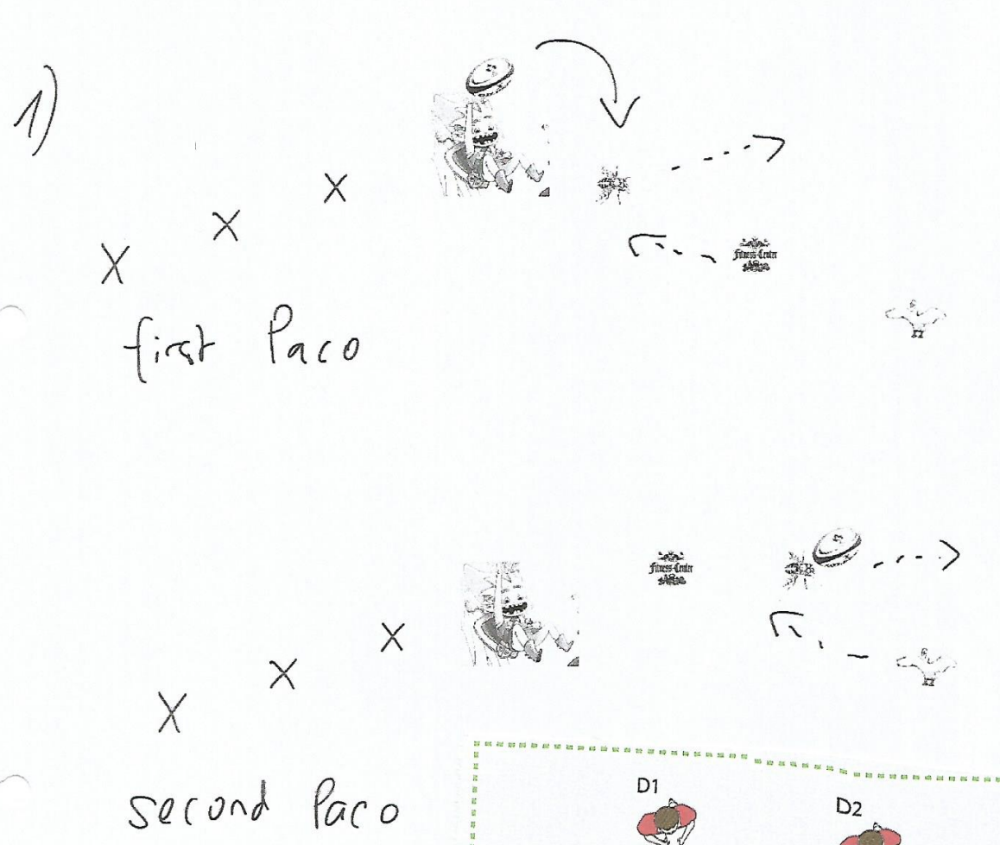
			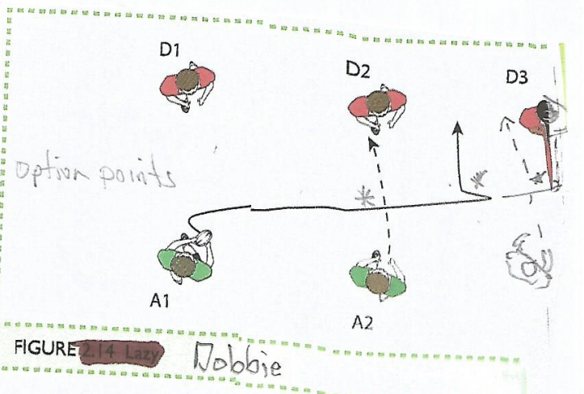
</details>

<details>
  <summary> *rot-weiß*/*weiß-rot*  </summary>
			- weiß = links; rot = rechts
			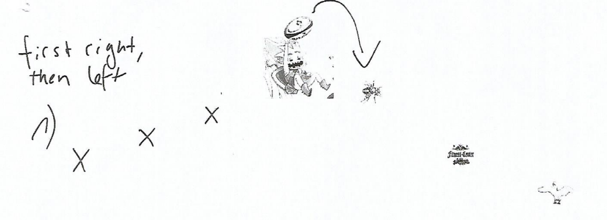
</details>

<details>
  <summary> *peter* (put away) </summary>
			- An offload in the tackle to a support player hitting the ball at pace is a simple but extremely effective way to break a defence. And the 'put-away' is effectively just this- an offload in the tackle with support - but where the offload and support is coordinated and not spontaneous. Most offloads happen in a game on impulse, when the ball carrier frees his arms in a tackle and has close support running on to the ball. The 'put-away' is a play that ensures both of these things happen from one simple call.
			- The ball carrier must first identify which defender is marking him, and then let the inside player know his intention ('Hey, John, I'm going to put you away'). Remember the simple lesson of when the ball carrier runs right, space is created on the left and vice versa. In a 'put-away, the ball carrier identifies which defender is marking him, steps inside the defender, engaging him in a tackle, and then makes an immediate offload to a support runner hitting space outside. In a 'put-away, it is not necessary for the ball carrier to beat the defender outright, but just to get to his inside and stretch him enough to make any tackle a passive one, which allows the offload. The success of the offload will be determined by the quality of the run, and so the ball carrier must aim to be as dynamic as possible also maintain leg drive through contact and aim to offload.
			
			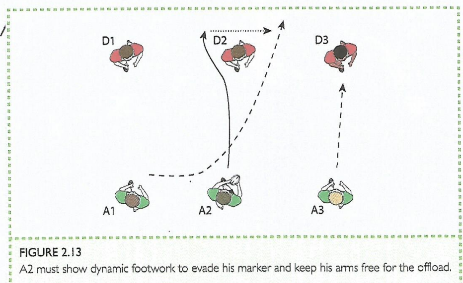
		
</details>

<details>
  <summary> *drecksau* (run the short side of the scrum) </summary>
			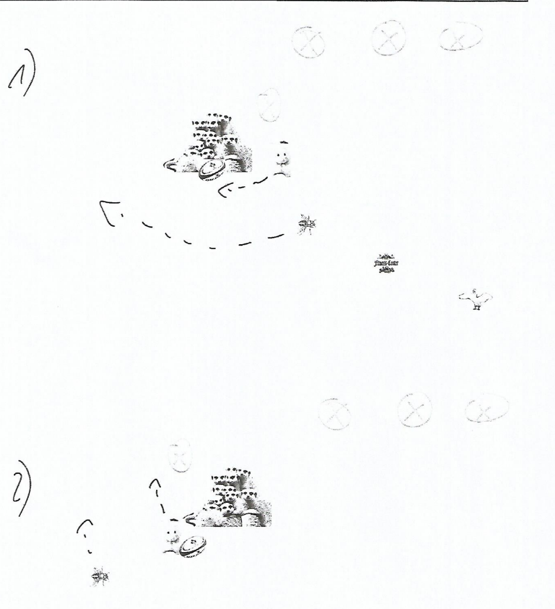
</details>

</div>

<div class="tabset">

### Defense
#### Position on the field
<details>
  <summary> Setup </summary>
  - picture showing everyine in one line
</details>
		
<details>
  <summary> Basics </summary>
		- target inside shoulder
		- other bla bla bla
</details>
		
#### Calls in defense
<details>
  <summary> *numbers* </summary>
			- this is a rushed defense bla bla bla
			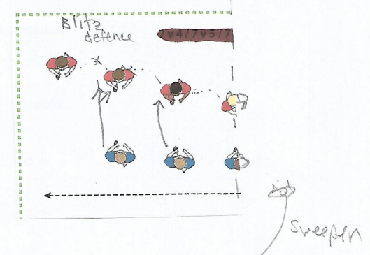
</details>

<details>
  <summary> *schieben* </summary>
			- this is the slide defense bla bla
			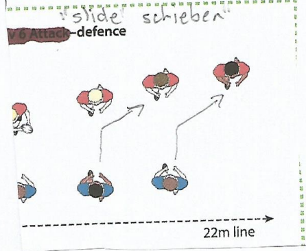
</details>
			
</div>

### Kick-offs
<details>
  <summary> we are kickin' </summary>
		- calls
			- *cover (rot/weiß)*: deep kick
			- *robber (rot/weiß)*: short kick
			- examples:
				- *robber rot* is a short kick to the right
				- *cover rot* is a deep kick to the right
			- structure: 4 players on the side of a kick call
			![[Pasted image 20240828130442.png]]
</details>

<details>
  <summary> we are receiving the kick </summary>
		
</details>

### Line-outs
### Scrum-downs
### Penalties


## IV. Strategies for special cases
what to do if we have a fast or strong team; sweeper or not; etc etc etc


## V. Glossary 
page/table for all terminology/calls/etc


``` frc_to_do's
THIS IS FOR RAFA ONLY
to do's:
[x] paste things from guide ("Playbook-v2") to obsidian
[x] paste everything to R Markdown
[x] fix formatting
[x] make it shareable
[] create animated version of each call & record screen
[] fix/add text everywhere
```
